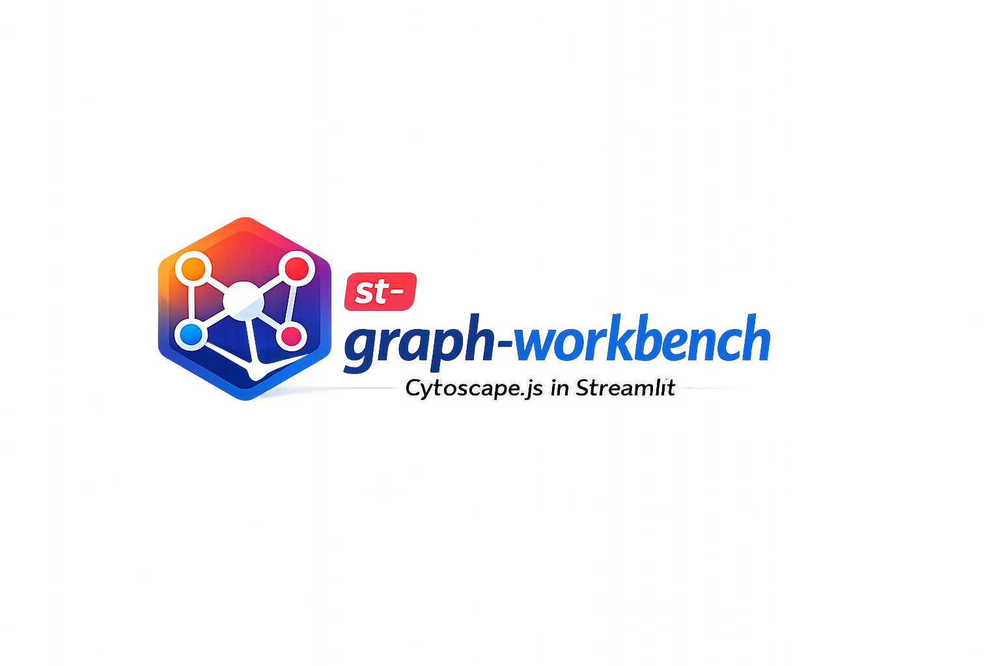
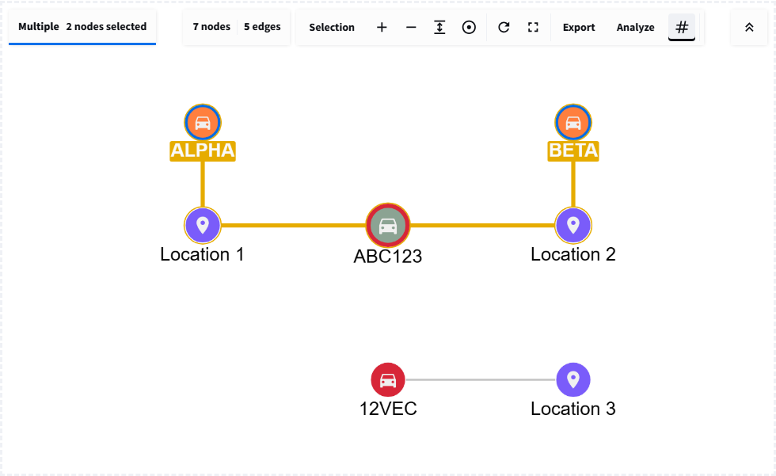
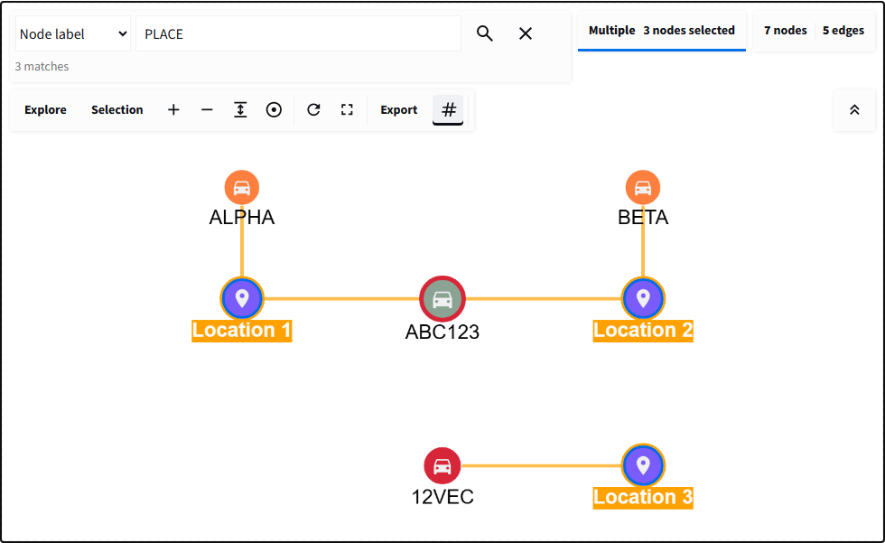
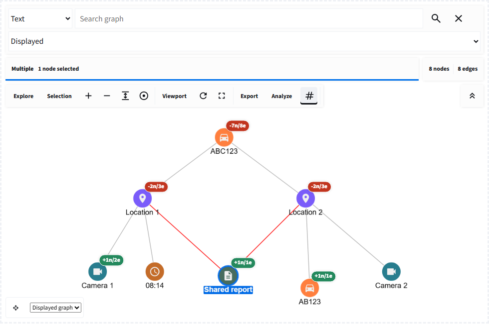
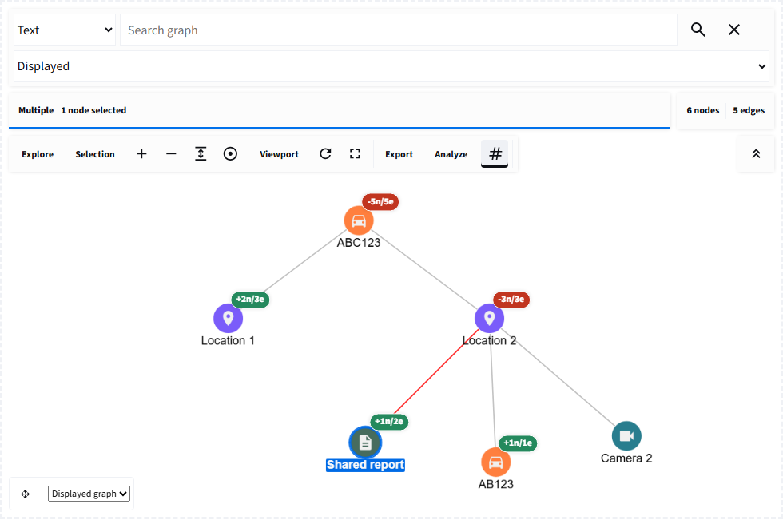
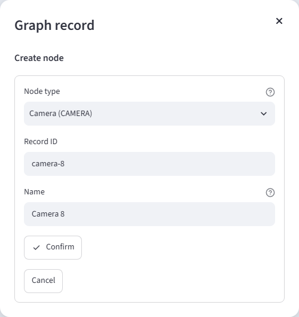

# st-graph-workbench

<p align="center">
  
</p>

`st-graph-workbench` is a general-purpose graph component for Streamlit,
powered by Cytoscape.js and integrated with Streamlit Components v2.
It helps you turn Python records into explorable
networks without building and maintaining a separate JavaScript application.
Users can search relationships, select records, expand connected data, run
graph analysis, edit structures, and return useful results to Python.

## Why st-graph-workbench

Build interactive applications around connected data. Users can explore
relationships, search and select nodes and edges, inspect records, run graph
analysis, or request edits, while your Python application handles the results.

Use it for knowledge graphs, dependency maps, workflows, network topologies,
or other connected datasets. You define what the nodes and relationships
represent; the library provides reusable exploration, styling, analysis,
editing, and event handling. Your application keeps control of its data and logic.

## On this page

- [What the library provides](#what-the-library-provides)
- [See it in action](#see-it-in-action)
- [Install](#install)
- [Create a graph from dictionaries](#create-a-graph-from-dictionaries)
- [Style nodes and edges](#style-nodes-and-edges)
- [Prepare dataframes and graph records](#prepare-dataframes-and-graph-records)
- [Turn selections into useful results](#turn-selections-into-useful-results)
- [Documentation](#documentation) and [interactive examples](#interactive-examples)
- [Core capabilities](#core-capabilities)
- [Advanced workflows](#advanced-workflows)
- [Development](#development)
- [License](#license) and [acknowledgements](#acknowledgements)

## What the library provides

- Turn validated Python dictionaries and dataframes into interactive graphs.
- Find relevant records with text, label, property, and selector search.
- Select individual records or groups and receive analysis-ready dictionaries.
- Keep graph controls readable with an adaptive, compact, or minimized toolbar that can reserve space above the canvas.
- Rigidly move a bounded one-to-three-hop connected neighborhood without changing selection or record data.
- Reveal connections progressively through expansion and neighborhood tools.
- Trace shortest paths and inspect traversals, components, and node degree.
- Add application-owned CRUD workflows without surrendering data control.
- Choose from ten layouts, preserve positions, and control the viewport.
- Apply domain styling and familiar icons to make complex networks readable.
- Export graph data, positions, and images for downstream data workflows.
- Scale interaction using incremental commands and performance profiles.
- Load large result sets in cursor-aware batches without resetting the viewport.

Python remains responsible for source records, authorization, persistence, and
business rules. The component supplies the interactive graph surface and sends
structured user actions back to the application.

## See it in action

**[Open the live interactive tutorials](https://st-graph-workbench.streamlit.app/)**
to build a first graph and then explore styling, selection, analysis, expansion,
editing, commands, exports, and progressive loading in the browser.

**Find a relationship, then use the result in Python.** Select two records and
run shortest path: the component highlights the route and returns its node IDs,
edge IDs, distance, and analysis scope. Use those results to filter a dataframe,
prepare a report, or drive the next step in your application.



*Real output from the analysis tutorial: five nodes on the route, four edges,
and a separate group outside the result. Icons, colors, and labels come from
the application's styles. The fictional sample records can be replaced with
dependencies, documents, infrastructure, or any other connected data.*

Continue through the screenshots below:

- [Search records while keeping context](#search-records-while-keeping-context).
- [Compare expansion before and after collapse](#collapse-a-branch-without-losing-shared-context).
- [Validate changes in a Python-owned dialog](#keep-validation-and-persistence-in-python).

All five screenshots come from runnable tutorials. The
[annotated screenshot gallery](https://github.com/ayhaidar/st-graph-workbench/blob/main/docs/getting-started/in-action.md)
also links each interaction to its tutorial and API guide.

> **Example data:** All datasets and records used in the examples,
> documentation, and screenshots are synthetically generated. They do not
> describe real people, vehicles, locations, organizations, claims, or
> incidents.

## Install

With `uv`:

```powershell
uv add st-graph-workbench
```

Or with `pip`:

```powershell
python -m pip install st-graph-workbench
```

For development from a source checkout:

```powershell
uv sync --extra dev --extra docs
```

The supported minimums are Python 3.10, pandas 2.2.2, and Streamlit 1.57.

## A small workflow, from records to results

The four examples below build on each other in one Streamlit script. They use
a small fictional vehicle-observation dataset only to illustrate the APIs;
the library is not specific to vehicles or any particular domain. Replace the
sample records, labels, and relationships with those from your own application.
Run the complete script with
`streamlit run app.py`; the [examples app](#interactive-examples) also runs
these same snippets and displays their results.

### Create a graph from dictionaries

Use `graph_workbench(...)` to render a dictionary with `nodes` and `edges`.
Here, vehicle `ABC123` was observed at `Harbour camera 7` at `08:14`.
The table appears before the graph, making the source of each element clear.

<!-- example: readme_graph.py -->
```python
import streamlit as st

from st_graph_workbench import graph_workbench, records_to_dataframe

# Each node needs a unique ID; edges refer to those IDs.
elements = {
    "nodes": [
        {"data": {"id": "ABC123", "label": "VEHICLE", "name": "ABC123"}},
        {"data": {"id": "camera-7", "label": "LOCATION", "name": "Harbour camera 7"}},
    ],
    "edges": [
        {
            "data": {
                "id": "sighting-1",
                "source": "ABC123",
                "target": "camera-7",
                "label": "SEEN_AT",
                "observed_at": "2024-09-02 08:14",
            }
        }
    ],
}

# Inspect the source records before exploring the graph.
st.dataframe(records_to_dataframe(elements), hide_index=True)
event = graph_workbench(
    elements,
    layout="cose",
    selection_mode="multiple",
    return_selection=True,
    search=True,
    key="readme_quick_start_output",
    height=420,
)
```
<!-- live-output: readme_graph.py -->

**Result:** two nodes joined by one edge, plus text search and multiple
selection. The edge keeps the observation time as data, available for
inspection. `event` is `None` before an interaction; afterwards it contains an
action name, a `data` dictionary, and a timestamp. A stable `key` identifies
the component across Streamlit reruns.

### Style nodes and edges

Use `NodeStyle(...)` to assign a color, display field, size, and packaged icon
to a node type. Use `EdgeStyle(...)` for relationship labels and arrows.

<!-- example: readme_style.py -->
```python
from st_graph_workbench import EdgeStyle, NodeStyle, graph_workbench

# Match the label in each node's data; display its name and a packaged icon.
node_styles = [
    NodeStyle("VEHICLE", "#2A629A", "name", "directions_car", size=40),
    NodeStyle("LOCATION", "#2D936C", "name", "place", size=40),
]
edge_styles = [
    EdgeStyle("SEEN_AT", "#2D936C", "label", directed=True),
]

# Reuse elements from the previous example with a separate component key.
event = graph_workbench(
    elements,
    layout="cose",
    node_styles=node_styles,
    edge_styles=edge_styles,
    selection_mode="multiple",
    return_selection=True,
    search=True,
    key="readme_styled_output",
    height=420,
)
```
<!-- live-output: readme_style.py -->

**Result:** a blue vehicle with a car icon, a green location with a place icon,
and a directed `SEEN_AT` relationship. Styles match the `label` values in
your data, so they apply to every element of that type. For conditional
formatting such as highlighting high-confidence observations, use
[`StyleRule(...)`](https://github.com/ayhaidar/st-graph-workbench/blob/main/docs/guides/styling-icons.md).

### Prepare dataframes and graph records

Use `records_to_dataframe(...)` to turn dictionaries, grouped records, graph
elements, or returned element records into a pandas dataframe. Use
`dataframe_to_records(...)` to convert table rows back into JSON-friendly
dictionaries, including normalization of dates and missing values.

<!-- example: readme_records.py -->
```python
from st_graph_workbench import dataframe_to_records, records_to_dataframe

# Named groups become a record_group column in the resulting dataframe.
sightings = {
    "sightings": [
        {"vehicle_id": "ABC123", "location": "Harbour camera 7", "time": "08:14"},
        {"vehicle_id": "ABC123", "location": "Depot gate", "time": "08:41"},
        {"vehicle_id": "12VEC", "location": "Depot gate", "time": "09:10"},
    ]
}
sightings_df = records_to_dataframe(sightings)

# Convert dataframe rows back into JSON-friendly dictionaries.
records = dataframe_to_records(sightings_df.drop(columns="record_group"))

# Decide which columns identify nodes; the helper does not infer relationships.
vehicle_df = sightings_df[["vehicle_id"]].drop_duplicates()
vehicle_df = vehicle_df.rename(columns={"vehicle_id": "id"})
vehicle_df["label"] = "VEHICLE"
vehicle_df["name"] = vehicle_df["id"]
vehicle_nodes = [{"data": row} for row in dataframe_to_records(vehicle_df)]
```
<!-- live-output: readme_records.py -->

**Result:** `sightings_df` has three rows and a `record_group` column containing
`"sightings"`; `records` is a list of the original evidence dictionaries.
`vehicle_nodes` contains two distinct vehicle nodes, each wrapped in
`{"data": ...}`, ready for a graph's `nodes` list.

These helpers convert data representations; they do not infer graph topology.
Your application chooses unique IDs and creates edges with explicit `source`
and `target` IDs. See the
[dataframe-to-graph recipe](https://github.com/ayhaidar/st-graph-workbench/blob/main/docs/recipes/intelligence-workflow.md)
for a complete relationship mapping.

### Turn selections into useful results

Use the returned selection to filter evidence, build a detail view, or prepare
IDs for a database query. This example uses `event` from the **styled graph**
and `sightings_df` from the previous section.

<!-- example: readme_selection.py -->
```python
import streamlit as st

from st_graph_workbench import records_to_dataframe

# Use the event from the styled graph and the source table above.
selection = event["data"] if event and event["action"] == "selection" else {}
selected_ids = selection.get("selected_node_ids", [])
selected_rows = records_to_dataframe(selection.get("selected_elements", []))

# Join graph IDs back to the source evidence, without changing that evidence.
matching_sightings = sightings_df[sightings_df["vehicle_id"].isin(selected_ids)]
st.metric("Matching sightings", len(matching_sightings))
st.dataframe(matching_sightings, hide_index=True)
```
<!-- live-output: readme_selection.py -->

**Result:** selecting `ABC123` in the styled graph returns its two sightings,
at `08:14` and `08:41`. With no vehicle selected, the result is an empty
table and a zero count. Clearing the selection clears the filtered result;
the source records remain unchanged.

In the returned dictionary, `action="selection"` identifies the interaction,
`data.selected_node_ids` supplies IDs for filtering, and
`data.selected_elements` supplies complete element records.
`selected_rows` flattens those records into a dataframe for a detail panel.
Search and analysis produce different payloads, so check `action` before
reading action-specific fields.

## Documentation

The MkDocs site summarizes what the library can do and provides feature guides,
practical recipes, troubleshooting help, and detailed API documentation for
the public functions, parameters, return values, and errors.

Read the published manual at
[ayhaidar.github.io/st-graph-workbench](https://ayhaidar.github.io/st-graph-workbench/).

Run it on any unused local port. This example uses `8000`:

```powershell
uv sync --extra docs
uv run mkdocs serve -f mkdocs.local.yml --dev-addr 127.0.0.1:8000
```

Start with:

- [Documentation home](https://ayhaidar.github.io/st-graph-workbench/)
- [Installation](https://ayhaidar.github.io/st-graph-workbench/getting-started/installation/)
- [Quick start](https://ayhaidar.github.io/st-graph-workbench/getting-started/quickstart/)
- [Feature guides](https://ayhaidar.github.io/st-graph-workbench/guides/rendering-layouts/)
- [API reference](https://ayhaidar.github.io/st-graph-workbench/reference/)
- [Troubleshooting](https://ayhaidar.github.io/st-graph-workbench/advanced/troubleshooting/)

Build the static documentation locally:

```powershell
uv run mkdocs build --strict
```

## Interactive Examples

Use the
[hosted tutorial and Feature Lab app](https://st-graph-workbench.streamlit.app/),
or run the same Streamlit application locally on port `8502`:

```powershell
uv run streamlit run examples/app.py --server.port 8502
```

Open `http://localhost:8502` to **Build your first graph**. Follow sixteen
independent tutorials from creating and styling records through selection,
analysis, editing, exports, commands, and progressive loading. Each lesson
shows source data, executable code, a live graph, and explained results.

Switch to **Feature Lab** for the comprehensive playgrounds and searchable icon
browser. The [learning path](https://github.com/ayhaidar/st-graph-workbench/blob/main/docs/getting-started/tutorials.md) explains the
sequence and state model; MkDocs provides the full manual and API reference.
The original live README walkthrough remains available at
`http://localhost:8502/readme`.

## Core Capabilities

- Validated Cytoscape-style nodes, edges, compound parents, and expansion data.
- Dataframe/record conversion and pure Python graph element helpers.
- Node, edge, selector, and packaged Material Symbols-style icon styling.
- Ten layouts including `preset`, `cose`, `fcose`, `dagre`, and `cola`.
- Search, single/multiple/box selection, neighborhood and visibility tools.
- An adaptive, compact, or minimized toolbar that can reserve its measured
  height so controls do not cover the graph.
- Opt-in bounded connected dragging with returned movement and position metadata.
- Shortest path, BFS, DFS, connected components, and degree analysis.
- Python-owned CRUD intents and idempotent incremental browser commands.
- Browser-local editing, position return, viewport control, and undo/redo.
- Visible/full/selected JSON, PNG, JPG, and node-position exports.
- Default, large, and dense performance profiles.
- Cursor-aware progressive loading with visible progress and incremental batches.
- Opt-in reversible branches, shared-record retention, bounded expand-all, cached
  search, scoped analysis, and exploration snapshots through `ExpansionController`.

The [expansion guide](https://github.com/ayhaidar/st-graph-workbench/blob/main/docs/guides/expansion-visibility.md) explains independent
branches and provides the corresponding tutorial and Feature Lab workflows.

### Add records only when they are useful

The in-graph **Load more** button is useful when a source dataset is larger than
the first question a user needs to answer. It requests the next bounded page;
Python remains responsible for authorization, filtering, pagination, validation,
and persistence. Add it by passing `progressive_loading` and handling the
returned `load_more` event with an incremental `add_elements_command`:

```python
progress = {
    "page_size": 100,
    "loaded_count": len(loaded_records),
    "total_count": total_records,
    "has_more": next_cursor is not None,
    "cursor": next_cursor,
}

value = graph_workbench(
    elements,
    progressive_loading=progress,
    graph_commands=[next_page_command],
    elements_sync="initial",
    key="records-graph",
    on_change=handle_graph_event,
)
```

Each accepted batch is appended to the existing browser graph, preserving
positions, pan, and zoom. A stable command ID prevents duplicate pages, and a
failed request can be retried without advancing the cursor. The local Feature
Lab includes **Progressive Loading** and a separate **Progressive Loading Scale
Test** for comparing 100 through 10,000 vehicle records in the browser.

The complete list of public exports and signatures is maintained in the
[API reference](https://github.com/ayhaidar/st-graph-workbench/blob/main/docs/reference/index.md). The
[capability matrix](https://github.com/ayhaidar/st-graph-workbench/blob/main/docs/reference/capability-matrix.md) maps every browser
module to its supported Python surface and demonstration page.
Developers can continue to the
[frontend architecture](https://github.com/ayhaidar/st-graph-workbench/blob/main/docs/advanced/architecture.md)
and [development guide](https://github.com/ayhaidar/st-graph-workbench/blob/main/docs/advanced/development.md)
for the component lifecycle, source layout, tests, builds, and packaging.

## Advanced workflows

### Search records while keeping context

Find starting points using text, node or edge labels, properties, or Cytoscape
selectors. Search returns matching IDs and complete records, so the same result
can populate a Python table or drive a follow-up query.



*Three locations match `PLACE`. The camera has been reframed after searching
to show the surrounding graph; other records have not been deleted. Selection
details are hidden, but selected records still return to Python.*

Use incoming/outgoing neighborhood tools to explore those matches. See
[selection and search](https://github.com/ayhaidar/st-graph-workbench/blob/main/docs/guides/selection-search.md)
for search modes, box selection, and returned dictionaries.

### Collapse a branch without losing shared context

`ExpansionController` distinguishes source records, the loaded cache, and the
displayed graph. Open independent branches, load more neighbors, and collapse
only the branch you are finished with. Shared records stay visible when another
active branch still needs them; reopening restores cached exploration.

**Before collapse:** both locations have been expanded and their remaining pages
loaded. Each branch contributes a connection to the Shared report.



*Eight nodes and eight edges are displayed. The selected Shared report belongs
to both active branches, rather than being owned exclusively by either location.*

**After collapse:** right-click Location 1 and choose **Collapse connections**.



*The displayed graph falls from eight nodes to six. Camera 1 and 08:14 are
hidden, not deleted. The selected Shared report remains connected through
Location 2. Node and edge counts are reported separately, and the viewport
stays in place.*

Bounded expand-all, pagination, filters, retry/cancel, protected records,
displayed/loaded/source analysis scopes, and exploration snapshots support
longer workflows. See the [expansion guide](https://github.com/ayhaidar/st-graph-workbench/blob/main/docs/guides/expansion-visibility.md)
and the [before/after screenshots](https://github.com/ayhaidar/st-graph-workbench/blob/main/docs/getting-started/in-action.md#expand-and-collapse-independent-branches).

### Keep validation and persistence in Python

A CRUD button emits an intent. Your Streamlit app can open a dialog, check
permissions and fields, then accept the change and send an incremental command.
The graph does not write directly to your database.



*This is the tutorial's real Streamlit dialog, populated but not yet submitted.
The node type choices belong to the application, not a fixed library schema.
Confirm validates and updates its Python checkpoint; Cancel leaves it unchanged.*

Use this approval-first workflow for governed records. For drafting, enable
browser-local editing with add/connect/delete, undo/redo, locking, and grid
snapping, then explicitly reconcile accepted edits with Python. See
[CRUD workflows](https://github.com/ayhaidar/st-graph-workbench/blob/main/docs/guides/crud.md) and
[browser editing](https://github.com/ayhaidar/st-graph-workbench/blob/main/docs/guides/editing-viewport.md).

## Development

```powershell
uv run ruff format --check .
uv run ruff check .
uv run mypy st_graph_workbench/
uv run pytest --reruns 0 -q
uv run mkdocs build --strict
uv build
```

Frontend checks:

```powershell
cd st_graph_workbench/frontend
npm ci
npm run format
npm run lint
npm run build
```

Webpack enforces a 512 KB entry and asset budget and keeps optional layout
engines in asynchronous chunks. The wheel ships the Components v2 manifest,
compiled frontend, and icons; the source distribution also contains examples,
tests, documentation, screenshots, and frontend source. Distributions also
include typing information and third-party license notices.

Before contributing, read
[CONTRIBUTING.md](https://github.com/ayhaidar/st-graph-workbench/blob/main/CONTRIBUTING.md).
Report security issues privately as described in
[SECURITY.md](https://github.com/ayhaidar/st-graph-workbench/blob/main/SECURITY.md).

## License

Original work in `st-graph-workbench` is licensed under the
[Apache License 2.0](https://github.com/ayhaidar/st-graph-workbench/blob/main/LICENSE).
Copyright 2026 Ali Haidar. See the
[NOTICE](https://github.com/ayhaidar/st-graph-workbench/blob/main/NOTICE) for project attribution.
Third-party code and assets retain their respective licenses, including the
MIT-licensed `st-link-analysis` foundation.

## Acknowledgements

It all started with `st-link-analysis`, whose original ideas and examples laid
the foundation for `st-graph-workbench` and its broader graph exploration,
analysis, and editing capabilities.

See the [third-party notices](https://github.com/ayhaidar/st-graph-workbench/blob/main/THIRD_PARTY_NOTICES.md)
for upstream attribution and bundled dependency licenses.

Built with [Cytoscape.js](https://js.cytoscape.org/),
[Streamlit](https://streamlit.io/), [Pandas](https://pandas.pydata.org/),
[Material Symbols](https://fonts.google.com/icons), and
[Material for MkDocs](https://squidfunk.github.io/mkdocs-material/).
