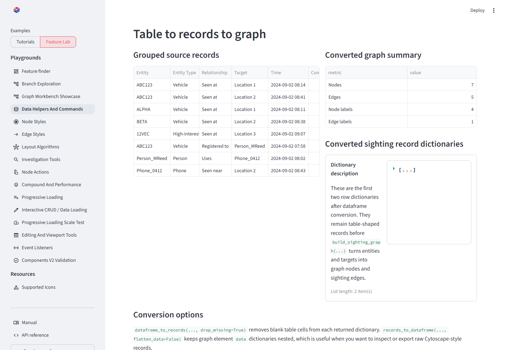

# Tables and records

## On this page

- [Why records are separate from elements](#why-records-are-separate-from-elements)
- [Dataframe to records](#dataframe-to-records)
- [Records to dataframe](#records-to-dataframe)
- [Returned graph records](#returned-graph-records)
- [Missing and nested values](#missing-and-nested-values)

## Why records are separate from elements

A record is a table-like dictionary. A graph element wraps business fields
inside `data` and may add graph-specific fields such as `position`. Conversion
helpers make both forms convenient in pandas without assuming how rows become
nodes and relationships.

## Dataframe to records

```python
--8<-- "docs/snippets/record_roundtrip.py"
```

`dataframe_to_records()` supports pandas, Polars, and Arrow-like objects that
expose a common record export method. It normalizes missing scalar values,
dates, decimals, tuples, sets, and array-like values into JSON-friendly data.

With `drop_missing=True`, the second sighting omits `confidence` instead of
returning it as `None`:

```json
[
  {
    "vehicle_id": "ABC123",
    "location": "Harbour camera 7",
    "observed_at": "2024-09-02 08:14",
    "confidence": 0.96
  },
  {
    "vehicle_id": "12VEC",
    "location": "Depot gate",
    "observed_at": "2024-09-02 09:10"
  }
]
```

## Records to dataframe

`records_to_dataframe()` accepts four useful shapes:

- A list of ordinary record dictionaries.
- Named groups such as `{"sightings": [...], "vehicles": [...]}`.
- Full graph elements such as `{"nodes": [...], "edges": [...]}`.
- Element records returned by selection or search events.

`group_key="record_group"` names the provenance column. Set
`flatten_data=False` when the nested Cytoscape `data` object should remain in
one dataframe cell instead of becoming columns.

{ .screenshot }

<p class="screenshot-caption">Source records, JSON-ready dictionaries, and flattened graph element rows.</p>

## Returned graph records

```python
--8<-- "docs/snippets/selected_records.py"
```

This pattern turns the analyst's current graph selection into rows that can be
filtered, joined with source data, summarized, reviewed, or exported.

## Missing and nested values

Missing scalar values become `None` unless dropped. Nested mappings remain
mappings; sequences become JSON-friendly lists. Non-string dictionary keys are
converted to strings. Unsupported dataframe objects and non-dictionary rows
raise `TypeError` with the failing boundary identified.

## Conclusion

Use dataframe helpers at the application boundary, then deliberately construct
graph elements with stable IDs and relationships. The helpers normalize data;
they do not infer graph topology.
