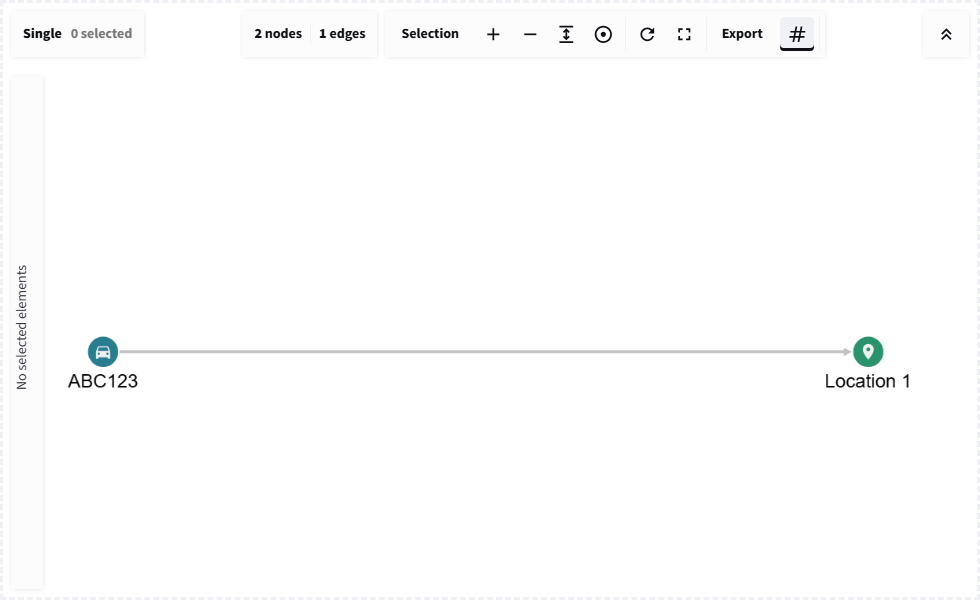

# Quick start

## On this page

- [The source data](#the-source-data)
- [Complete application](#complete-application)
- [Expected graph](#expected-graph)
- [Returned dictionary](#returned-dictionary)
- [What to try](#what-to-try)

## The source data

This first graph connects vehicle `ABC123` to a harbour camera and an
observation time. Every node has an `id`, `label`, and display `name`; every
edge identifies its `source` and `target` node IDs.

| Record | ID | Type or relationship | Connected IDs |
| --- | --- | --- | --- |
| Node | `ABC123` | `VEHICLE` | |
| Node | `camera-7` | `LOCATION` | |
| Node | `time-0814` | `TIME` | |
| Edge | `ABC123-camera-7` | `SEEN_AT` | `ABC123` to `camera-7` |
| Edge | `camera-7-time-0814` | `OBSERVED_DURING` | `camera-7` to `time-0814` |

## Complete application

Create a Streamlit file with this code and run it with `streamlit run`:

```python
--8<-- "docs/snippets/quickstart.py"
```

The stable `key` identifies this graph across Streamlit reruns. The node and
edge style helpers turn business labels into Cytoscape selectors and visual
properties.

## Expected graph

{ .screenshot }

<p class="screenshot-caption">The quick-start graph and its returned event area in the Streamlit examples app.</p>

## Returned dictionary

After selecting the vehicle, `graph_workbench()` returns a dictionary similar
to this one:

<div class="scrollable-code" markdown>
```json
{
  "action": "selection",
  "data": {
    "selected_node_ids": ["ABC123"],
    "selected_edge_ids": [],
    "connected_node_ids": ["camera-7"],
    "connected_edge_ids": ["ABC123-camera-7"],
    "last_selected": {
      "group": "node",
      "data": {
        "id": "ABC123",
        "label": "VEHICLE",
        "name": "ABC123"
      }
    },
    "selected_elements": [
      {
        "group": "node",
        "data": {
          "id": "ABC123",
          "label": "VEHICLE",
          "name": "ABC123"
        }
      }
    ]
  },
  "timestamp": 1780000000000
}
```
</div>

`action` identifies the interaction family. The nested `data` dictionary
contains compact ID lists for queries and complete element records for tables,
exports, or application logic. `timestamp` distinguishes a new interaction
from the value retained across a Streamlit rerun.

## What to try

1. Select the vehicle and inspect `selected_node_ids`.
2. Search for `08:14` and inspect the matched element records.
3. Change `layout="cose"` to `layout="circle"`.
4. Convert the returned records to a dataframe with
   `records_to_dataframe(event["data"]["selected_elements"])`.

## Conclusion

The graph is a view over Python-owned records. Continue with
[How it works](mental-model.md) before adding persistent editing or expansion.
