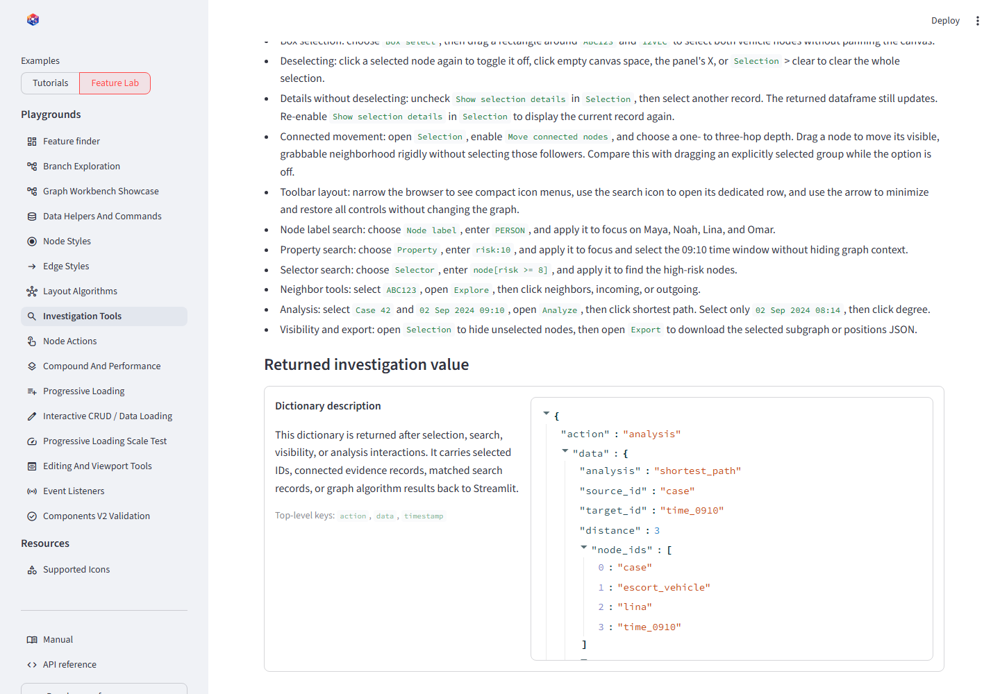

# Graph analysis

## On this page

- [Enable analysis](#enable-analysis)
- [Algorithms](#algorithms)
- [Analysis scope](#analysis-scope)
- [Selection requirements](#selection-requirements)
- [Clear highlights](#clear-highlights)
- [Returned dictionaries](#returned-dictionaries)
- [Using results](#using-results)

## Enable analysis

```python
analysis_actions = [
    "shortest_path",
    "bfs",
    "dfs",
    "connected_components",
    "degree",
]
```

These algorithms execute against the live Cytoscape graph in the browser. The
result is highlighted and returned to Streamlit as an `analysis` event.

## Analysis scope

The default is the **Displayed graph**, excluding hidden records. With managed
expansion enabled, **Loaded records** runs the same Cytoscape algorithms in a
separate headless instance over cached nodes and edges, including collapsed
branches. Only displayed matches are highlighted; `collapsed_result_ids` reports
the remainder. Degree uses the same scope as paths and traversals; a self-loop
contributes two to total degree and one each to incoming and outgoing degree.

**Source dataset** is available only through an application provider supporting
`analyze(request)`. Unsupported algorithms produce an explicit error. Nothing
silently substitutes the smaller displayed graph. See the
[managed expansion guide](expansion-visibility.md) and open the working
tutorial at `/learn_expansion` in the local examples app.

## Algorithms

| Action | Question answered | Result fields |
| --- | --- | --- |
| `shortest_path` | What is the shortest connection between two selected nodes? | source ID, target ID, distance, node IDs, edge IDs |
| `bfs` | What is reached breadth-first from one selected node? | root, visit order, node IDs, edge IDs |
| `dfs` | What is reached depth-first from one selected node? | root, visit order, node IDs, edge IDs |
| `connected_components` | Which disconnected groups exist? | component count and node-ID groups |
| `degree` | How connected is one selected node? | degree, indegree, outdegree, edge IDs |

## Selection requirements

Shortest path requires exactly two selected nodes. BFS, DFS, and degree require
one selected node. Connected components runs without a selection. Buttons are
disabled when the current selection cannot satisfy the algorithm.

{ .screenshot }

<p class="screenshot-caption">The highlighted result remains tied to an explicit dictionary returned to Python.</p>

## Clear highlights

**Selection > Clear Selection** and the details panel's **X** remove selected
records and analysis-result highlights from both nodes and edges. This does
not delete graph data, change the viewport, clear search matches, or erase an
analysis result already saved by Python. Ordinary deselection, such as clicking
blank canvas, leaves analysis highlighting available for inspection.
Source-provider results retain `request_id`: repeating the analysis deliberately
reapplies its highlights, even when its records and counts have not changed.

## Returned dictionaries

<div class="scrollable-code" markdown>
```json
{
  "action": "analysis",
  "data": {
    "analysis": "shortest_path",
    "source_id": "case-42",
    "target_id": "time-0910",
    "distance": 3,
    "scope": "visible",
    "source_dataset_id": "connected-records",
    "source_version": "2026-01",
    "view_revision": 4,
    "complete": true,
    "source_complete": false,
    "node_ids": ["case-42", "ABC123", "camera-7", "time-0910"],
    "edge_ids": ["case-vehicle", "vehicle-camera", "camera-time"]
  },
  "timestamp": 1780000000000
}
```
</div>

The IDs can retrieve authoritative records, generate an evidence table, create
a selected-subgraph export, or launch a server-side algorithm that applies
domain-specific weights and permissions.
`complete` describes the selected scope, not source coverage. `source_complete`
prevents interpreting a loaded subset as the entire dataset. Graph `node_count`
and `edge_count` describe the input scope; result IDs describe matches.

## Using results

Browser algorithms are excellent for interactive exploration. They are not a
replacement for audited server-side analytics where edge weights, access
control, reproducibility, or very large graphs matter. Use the event as a
request or starting set in those workflows.

## Conclusion

Expose only algorithms relevant to the current task and explain the required
selection. Always present the returned path or component records alongside the
visual highlight when results influence a decision.
