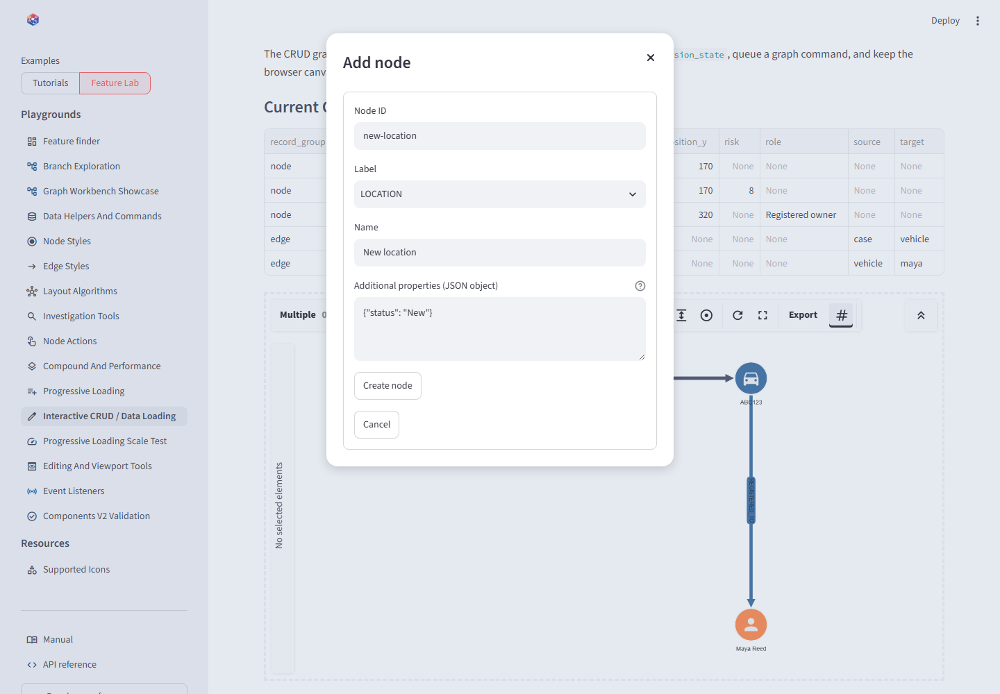

# CRUD and data loading

## On this page

- [CRUD ownership](#crud-ownership)
- [CRUD or browser editing?](#crud-or-browser-editing)
- [Choosing record types](#choosing-record-types)
- [Available intents](#available-intents)
- [Event context](#event-context)
- [Dialog workflow](#dialog-workflow)
- [Safe mutation sequence](#safe-mutation-sequence)

## CRUD ownership

CRUD buttons emit structured intents. Python owns dialogs, validation,
authorization, persistence, and graph mutation. This keeps database credentials
and business rules outside the browser component.

## CRUD or browser editing?

CRUD changes are **approval-first**: request, Python form, validation, then an
accepted change. [Browser editing](editing-viewport.md#browser-editing-or-crud)
changes the displayed graph immediately and reports the edit afterward.

- Record a confirmed vehicle sighting with CRUD; sketch a possible connection
  with browser editing while reviewing evidence.
- Maintain an approved service-dependency inventory with CRUD; experiment with
  a proposed dependency and undo it using browser editing.
- Validate a maintained process or knowledge-graph relationship with CRUD; use
  browser drafts to explore alternative flows in a workshop.

Both can be used in one application: draft, review, assign domain types, then
validate and explicitly save accepted changes in Python. Neither a browser event
nor a style constitutes authorization. The tutorial's accepted records live in
session state; it does not implement database persistence or automatic promotion.

## Choosing record types

The local CRUD tutorial at `/learn_crud` offers node types for locations
(`PLACE`), vehicles, people, phones, cameras, times, and checkpoints.
Its relationship choices are Seen At, Registered To, Uses, Seen Near, and
Related. These are sample application choices, not library restrictions.

`id` identifies the record, `label` selects its category and matching style, and
`name` is separate display text. Choose Camera and enter Camera 8 to create a
camera; changing the name alone does not change the category. Select at least
one node to enable Create edge. Selecting two nodes prefills both endpoints in
the tutorial dialog; confirm the source and target explicitly. Add domain rules about allowed types before saving production
records; the tutorial validates IDs and graph references, not those business rules.

Confirmed changes update the accepted Python table and send an incremental
command to the browser. The displayed command is an instruction, not a browser
readback. The local CRUD Feature Lab at `/crud_data_loading` adds custom-property
forms for more detailed experiments.

## Available intents

| Value | Intended application response |
| --- | --- |
| `create_node` | Open an add-node form, using the suggested graph position |
| `create_edge` | Open an edge form, seeded from selected nodes |
| `read_selected` | Display selected and connected records |
| `update_selected` | Edit the data of exactly one selected element |
| `delete_selected` | Confirm removal of selected IDs and incident edges |
| `request_node_data` | Query and load records related to one selected node |

## Event context

A CRUD event's `data` dictionary can contain:

- `operation`: requested CRUD operation.
- `selected_node_ids` and `selected_edge_ids`: compact mutation targets.
- `connected_node_ids` and `connected_edge_ids`: immediate graph context.
- `last_selected`: complete most-recently selected element.
- `selected_elements` and `connected_elements`: complete records for forms,
  inspection, exports, and joins.
- `suggested_position`: browser coordinate for a new node.

## Dialog workflow

{ .screenshot }

<p class="screenshot-caption">The component requests creation; a Streamlit dialog collects and validates the durable record.</p>

Use `@st.dialog`, place related fields in `st.form`, and mutate only after the
form submits. Store the event that opened the dialog so its selection context
remains available during the dialog rerun.

```python
@st.dialog("Add node")
def create_node_dialog(event):
    with st.form("create-node"):
        node_id = st.text_input("Node ID")
        label = st.text_input("Label", value="LOCATION")
        name = st.text_input("Name")
        submitted = st.form_submit_button("Create node")

    if submitted:
        command = upsert_elements_command(
            next_command_id("create-node"),
            nodes={
                "data": {"id": node_id, "label": label, "name": name},
                "position": event["data"]["suggested_position"],
            },
        )
        queue_graph_command(command)
        st.rerun()
```

## Safe mutation sequence

1. Deduplicate the event timestamp.
2. Validate the operation and current selection.
3. Collect application fields in a dialog.
4. Validate IDs, endpoint references, and business rules.
5. Persist to the authoritative store.
6. Apply the same command to Python graph state.
7. Send the unique command to the browser.
8. Clear dialog and command state after it has been handled.

When deleting a node with `remove_incident_edges=False`, reject the operation
if it would leave dangling edge references.

## Conclusion

The graph is an efficient CRUD surface, not the data authority. Keeping writes
in Python makes dialogs testable and prevents a failed edge creation from
leaving browser and session state inconsistent.
