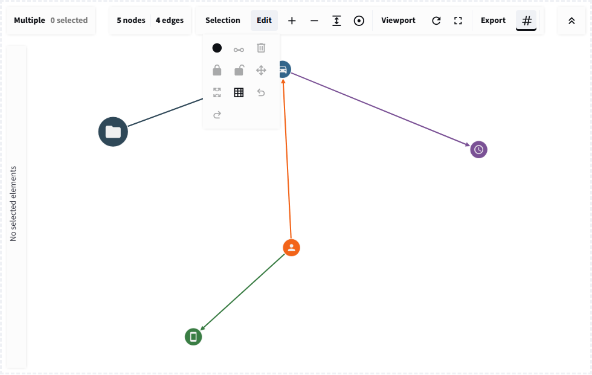

# Editing and viewport tools

## On this page

- [Browser-local editing](#browser-local-editing)
- [Browser editing or CRUD?](#browser-editing-or-crud)
- [Draft types and returned records](#draft-types-and-returned-records)
- [Edit actions](#edit-actions)
- [Viewport actions](#viewport-actions)
- [Viewport options](#viewport-options)
- [Mirroring browser state](#mirroring-browser-state)

## Browser-local editing

Edit actions change Cytoscape immediately and return an `edit` event. This
provides responsive interaction while allowing Python to accept, reject,
persist, or audit the change afterward.

## Browser editing or CRUD?

Browser editing is **edit-first**: an immediate change, then a Python event.
[CRUD](crud.md#crud-or-browser-editing) is approval-first: Python validates and
accepts a request before changing the graph.

- Sketch a possible sighting connection with browser editing; use CRUD when
  recording a confirmed observation in the maintained dataset.
- Try alternative service dependencies with undo/redo; use CRUD to update the
  approved inventory after checking required fields and permissions.
- Draft alternative process flows during a workshop; use CRUD to accept and
  maintain the chosen workflow or knowledge-graph relationships.

A combined application can review drafts, assign domain types, then explicitly
validate and save them in Python. The tutorial does not automatically promote
drafts or save them to a database. Browser undo does not undo an external write.

## Draft types and returned records

The browser's Add Node tool creates `label="NODE"` with a generated ID and name.
Connect creates `label="RELATED"`. The local editing tutorial at
`/learn_editing` styles these as gold document nodes labelled Draft node and
dashed links. Their actual data is not renamed. This is a lesson-specific
styling convention, not a built-in approval
flag; the CRUD dialog offers domain-type choices before creating a record.

The tutorial places the Python checkpoint beside the **latest browser edit
report**. It does not copy browser edits into the source records. Adding a draft
produces 8 browser nodes versus 7 Python nodes. Added/updated records are partial
results; deletion returns IDs, grid snapping returns positions, and undo/redo
returns a full snapshot. The counts describe the last reported edit, not a live
readback. Later selection events do not replace that report.

The local Editing Feature Lab at `/editing_viewport_tools` demonstrates an
additional choice: mirroring edit events into Python session state. Mirroring
is application code, not automatic database persistence.

## Edit actions

| Value | Browser behavior |
| --- | --- |
| `add_node` | Adds a temporary node near the viewport center |
| `connect_selected` | Connects exactly two selected nodes |
| `delete_selected` | Removes selected nodes and edges |
| `lock_selected` / `unlock_selected` | Changes layout locking |
| `make_ungrabbable` / `make_grabbable` | Disables or enables node dragging |
| `snap_to_grid` | Rounds node positions to the browser grid |
| `undo` / `redo` | Moves through bounded browser edit history |

The `large` and `dense` profiles use smaller undo histories to control memory.

## Viewport actions

| Value | Behavior |
| --- | --- |
| `toggle_zoom` | Enables or disables user zoom gestures |
| `toggle_pan` | Enables or disables user canvas panning |
| `save_viewport` | Stores current pan and zoom in the component instance |
| `restore_viewport` | Restores the saved browser view |
| `reset_viewport` | Resets and fits the graph |

The standard view bar also exposes fit, center, and zoom controls.

{ .screenshot }

Immediate browser tools return operation details that Python can mirror into durable state.

## Viewport options

`min_zoom`, `max_zoom`, and `wheel_sensitivity` constrain browser navigation.
Bounds update on the live graph. Wheel sensitivity is initialization-only and
needs a changed key when its value must change after mounting.

## Mirroring browser state

For each new `edit` event, use its operation and returned elements/IDs to update
Python state. For `positions` events, copy each position into its matching node.
Deduplicate by timestamp, then validate the resulting graph before persisting.

Browser undo is not durable across remounts. Applications requiring durable
history should store domain operations in Python or the backing service.

## Conclusion

Use browser editing for immediacy and Python for authority. Document which
actions are automatically persisted so users do not confuse a visual edit with
a committed record change.
