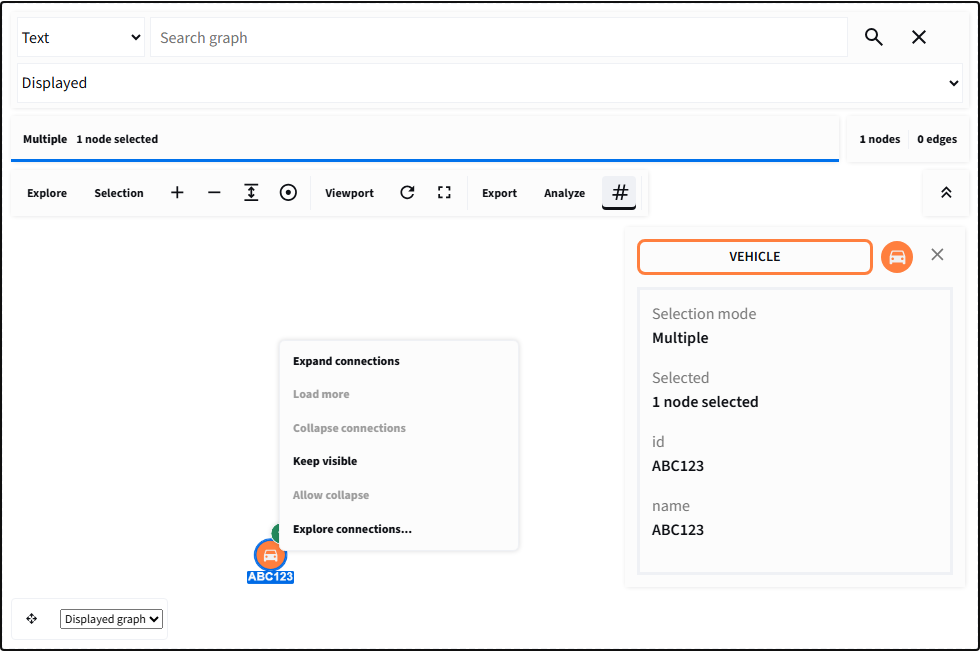

# Expansion and visibility

## On this page

- [Managed branches](#managed-branches)
- [Source data and example](#source-data-and-example)
- [Requests and returned dictionaries](#requests-and-returned-dictionaries)
- [Limits, search, and analysis](#limits-search-and-analysis)
- [Node actions](#node-actions)
- [Right-click workflow](#right-click-workflow)
- [Expansion metadata](#expansion-metadata)
- [Python expansion](#python-expansion)
- [Neighborhood and visibility](#neighborhood-and-visibility)
- [Position stability](#position-stability)

## Managed branches

Use `ExpansionController` for independent, reversible exploration. Source data,
loaded records, and displayed records have different roles. Collapse removes
records only from the displayed graph, retaining cached edits and positions.
It does not delete database rows or dataframe records.

Expand `ABC123` to discover its locations, then expand each location separately.
Collapsing Location 1 retains the vehicle and both locations; the shared report
remains visible through Location 2. Deeper branches are remembered and return
when Location 1 reopens. Cycles do not retain an unanchored branch.

Right-click offers **Expand connections**, **Load more**, **Collapse connections**,
and **Keep visible**. Keeping a record visible is separate from locking its position.
The Python `protect` method also accepts edges, keeping their endpoints available
as anchors for later exploration and search.
When calling `collapse`, an explicit `branch_id` closes only that branch, even
when its starting node is also selected. Without `branch_id`, the selected nodes'
branches are closed together.
The connections dialog contains direction, relationship, exact-match property,
and ISO-8601 time filters, configurable limits, and individual cached branches.
An exact `None` attribute matches an explicit null value, not a missing property.
Time ranges are validated before scheduling: the start cannot follow the end,
and timestamps without an offset are interpreted as UTC.
**Collapse all** closes every branch, retaining starting/protected records.

## Source data and example

The shared example has 12 nodes and 13 edges: two vehicles, three locations,
two cameras, two times, and three reports/attachments. The first view contains
only ABC123. Location 1 and Location 2 connect to the same report; Camera 1
and its sighting form a cycle. These sample entities illustrate general graph
exploration, not a domain restriction.

```python
--8<-- "docs/snippets/managed_expansion.py"
```

The output dataframe retains the shared report after Location 1 collapses.
The change dataframe explains each added, hidden, or retained record. The loaded
cache is unchanged by collapse, and the snapshot assertion verifies restoration.

Run `/learn_expansion` or `/branch_expansion` in the local examples app. They
execute the same workflow, showing source records before code and graph.

## Requests and returned dictionaries

Pass `controller.describe(provider)` to `graph_workbench(expansion=...)`, a stable
`key`, and `controller.commands(previous_view)` for incremental updates with
`elements_sync="initial"`. In the callback, pass the event to `handle_event` and
retain returned positions using `update_records`.

An event's `data.operation` identifies the intent; `data.node_ids` identifies its
anchors; `data.request_id` deduplicates delivery; `data.controller_id` rejects
events from an obsolete controller. Provider requests additionally include
`branch_id`, `query`, `cursor`, `limit`, `source_id`, `source_version`, and `revision`.

Responses contain `request_id`, `elements`, `has_more`, `cursor`, `total_nodes`,
and `total_edges`. Totals count distinct records separately; `None` means unknown.
A continuing page must advance its cursor. Edges can refer to loaded endpoints.
Overlapping records are deduplicated and do not overwrite explicit cached edits.

Badges show node and edge changes separately, such as `+2n/2e`. Counts describe
the next displayed change, not degree. A shared record excluded from a collapse
is excluded from that collapse count. Edge-only expansion remains available.
Remote providers without a cheap local preview show unknown next counts.

`controller.changes` is dataframe-ready: `id` identifies the record, `kind`
distinguishes node/edge, `change` is added/hidden/retained, and `reason` explains
starting, protected, shared, active-branch, or not-in-view status.
`retained_by` lists the starting nodes of branches that currently require that record.

## Limits, search, and analysis

The managed-expansion toolbar compacts earlier than a simple graph toolbar
because it carries source-scope and branch controls. Select the search icon to
open its dedicated row. Closing that row returns the measured space to the
canvas without changing loaded records, branch state, selection, or search
results.

Defaults are 50 neighbors per page, depth 3, 500 additional displayed nodes, and
2,000 additional displayed edges. The interactive example uses pages of two to
make pagination observable. Bulk execution processes one batch per continuation;
cancel prevents future batches and invalidates late responses. It cannot abort an
application's already-running network call. Oversized batches are rejected whole,
so a limit can stop below its numerical maximum.

Failures preserve the last valid graph and cursor. Retry uses a new request ID.
Errors from filtered branches also appear in the graph status area; reopen the
connections dialog and retry with the same filters.
Receipt acknowledgment is separate from provider completion; persistent request
state survives Components v2 reruns. Source-version invalidation rejects old data.
Successful requests remain acknowledged if a later callback fails. Receipts for
requests still queued in the browser are retained until that queue drains.
Hiding or filtering a pending request's starting node invalidates its response,
even if the node is subsequently restored before that response arrives.
Managed incremental commands also remain pending until the browser acknowledges
them. An unchanged view produces no new commands, avoiding selection/rerun loops.

For asynchronous providers, call `request`, schedule the returned request in your
application, then call `apply_response` on completion. Keep credentials, timeouts,
authorization, and worker scheduling in the application. The synchronous
`expand` and `handle_event` helpers intentionally do not create background workers.
Apply controller state changes on one owner thread; workers should return
responses for that thread to validate and apply.

Search offers displayed, loaded, and provider-backed source scopes. Revealing
a cached result reopens its recorded path. Source results must contain actual
context paths; disconnected results are reported, never connected artificially.
Revealing a source match respects cached edge edits and deletions. A path that no
longer exists is rejected without changing the current graph; repeat the search
against the updated source instead.

Analysis defaults to **Displayed graph**. **Loaded records** uses a separate
headless Cytoscape graph. **Source dataset** requires a provider implementing
`analyze(request)`; unsupported analyses must fail explicitly, not fall back.
The example provider implements source degree. Result dictionaries state scope,
source/version, view revision, graph counts, and completeness; collapsed result
IDs are listed separately from highlighted visible records.
Browser results use `scope="visible"` or `scope="loaded"`, `source_dataset_id`,
`source_version`, and `view_revision`. `complete=True` means complete for the
chosen graph, while `source_complete=False` prevents interpreting a partial cache
as the full source. Shortest-path `source_id` still identifies its starting node.

Snapshots include versioned cached records, branches, independent masks,
protected IDs, positions, and viewport, but no provider or credentials. Application
properties may still contain sensitive data: treat snapshot files like source data.
Restore requires the same source version; pass the expected `source_id` too when
accepting uploaded snapshots. Use `commands(previous, restore_positions=True)`
and a `set_viewport` command when explicitly restoring saved coordinates and view.
Use `invalidate` explicitly for a new
checkpoint. Keep actual CRUD deletion (`delete_records`) separate from collapse.
Edge updates through `update_records` include `id`, `source`, and `target`, as
required by `upsert_elements`. Snapshots resolve starting records against current
cached edits and retain required edge endpoints and compound parents.
Cached records and positions must be JSON-compatible; invalid coordinates or
malformed batches fail before replacing the last valid graph.

## Node actions

`node_actions` accepts these values:

- `remove`
- `expand`
- `show_neighbors`
- `show_incoming`
- `show_outgoing`
- `hide_unselected`
- `restore_hidden`

The toolbox exposes enabled actions. A node context menu provides the most
direct expand, collapse, and remove workflow.

## Right-click workflow

{ .screenshot }

<p class="screenshot-caption">Right-click a node to request expansion or collapse; the badge comes only from explicit metadata.</p>

The browser emits an intent containing the relevant node IDs. Python then
queries related data, validates it, and updates the authoritative graph.

## Expansion metadata

A collapsed node may report `next_count`, `total_count`, and `depth`; an
expanded node may report `collapse_count`. Metadata controls only the badge and
summary. It does not contain or automatically fetch the related records.

Omit `data.expansion` from nodes with no expansion. This avoids misleading
badges on terminal records.

## Python expansion

```python
--8<-- "docs/snippets/progressive_expansion.py"
```

Production handlers should also deduplicate timestamps, persist positions, and
support collapse by tracking which nodes and edges each expansion introduced.

## Neighborhood and visibility

`show_neighbors`, `show_incoming`, and `show_outgoing` temporarily filter the
visible graph around the current selection. `hide_unselected` keeps selected
elements and their immediate connective context. `restore_hidden` shows all
elements again. These operations do not delete Python records.

Visibility events return the operation and visible node/edge IDs, which can be
used to synchronize a table or describe the current analytical view.

## Position stability

Expansion should preserve the existing viewport and positions. Place newly
loaded nodes near the expanded node, reuse returned positions, and avoid
rerunning a full layout after every small update. For command-driven graphs,
add elements incrementally and run a layout only when the analyst requests it.

## Conclusion

Expansion is an application query initiated from the graph. Accurate metadata,
idempotent handlers, and stable positions make it predictable at increasing
node counts.
