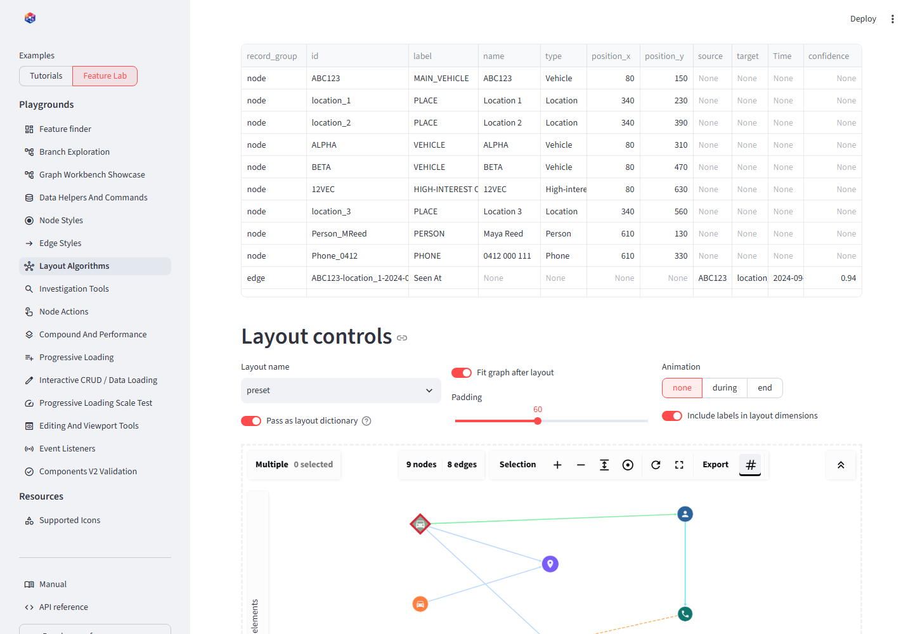

# Rendering and layouts

## On this page

- [Component options](#component-options)
- [Adaptive toolbar](#adaptive-toolbar)
- [Supported layouts](#supported-layouts)
- [Layout dictionaries](#layout-dictionaries)
- [Preset positions](#preset-positions)
- [Live updates and remounts](#live-updates-and-remounts)

## Component options

`graph_workbench()` groups its options by responsibility:

| Concern | Options |
| --- | --- |
| Graph input | `elements`, `layout`, `node_styles`, `edge_styles` |
| Streamlit identity | `key`, `on_change`, `height` |
| Node workflows | `node_actions`, `crud_actions`, `edit_actions` |
| Interaction | `events`, `selection_mode`, `return_selection`, `show_selection_details`, `connected_drag`, `search`, `toolbar` |
| Analysis and output | `analysis_actions`, `return_positions` |
| Viewport | `viewport_actions`, `min_zoom`, `max_zoom`, `wheel_sensitivity` |
| Scale and synchronization | `performance_profile`, `graph_commands`, `elements_sync` |
| Validation | `validate` |

Action arguments take lists even when one action is enabled. `height` is a
positive integer pixel value. Zoom bounds and wheel sensitivity must be finite;
`min_zoom` cannot exceed `max_zoom`, and sensitivity must be greater than zero.

## Adaptive toolbar

The toolbar defaults to an adaptive top position. It uses labelled menus when
the component is wide and compact icon menus when width is limited. Its measured
height is reserved above the Cytoscape canvas, including when compact search is
opened, so wrapped controls do not cover nodes.

```python
graph_workbench(
    elements,
    toolbar={
        "mode": "adaptive",  # adaptive, expanded, compact, or minimized
        "position": "top",
        "collapsible": True,
        "sticky": True,      # reserve toolbar space above the canvas
    },
)
```

The minimize/restore control changes only presentation. A stable component key
preserves that browser preference through ordinary reruns. Set
`collapsible=False` for an application-controlled presentation, or `sticky=False`
to intentionally overlay the toolbar on the canvas. Frontend contributors can
follow the complete component lifecycle in
[Frontend architecture](../advanced/architecture.md).

## Supported layouts

| Layout | Best suited to |
| --- | --- |
| `preset` | Saved or manually assigned positions |
| `cose` | General force-directed exploration |
| `fcose` | Higher-quality force-directed layouts and compound graphs |
| `dagre` | Directed and hierarchical flows |
| `cola` | Constraint-oriented force layouts |
| `grid` | Regular comparison without topology emphasis |
| `circle` | Small networks and equal visual treatment |
| `concentric` | Ranking nodes around a center |
| `breadthfirst` | Rooted traversal or tree-like relationships |
| `random` | Diagnostics and a neutral starting distribution |

{ .screenshot }

<p class="screenshot-caption">The layout demo keeps the records fixed so only node placement changes.</p>

## Layout dictionaries

A string uses library defaults. A dictionary forwards supported Cytoscape
layout options after validating `name`:

```python
layout = {
    "name": "dagre",
    "rankDir": "LR",
    "fit": True,
    "padding": 48,
    "animate": False,
}
```

For a command-driven graph, request a new layout without replacing elements:

```python
command = viewport_command(
    "layout-after-expansion",
    "run_layout",
    layout={"name": "fcose", "fit": True, "padding": 40},
)
```

## Preset positions

Each positioned node uses `{"position": {"x": ..., "y": ...}}` and the graph
uses `layout={"name": "preset", "fit": True}`. Do not select `preset` for
records that do not contain positions unless an empty/default placement is
acceptable.

## Live updates and remounts

Changing `layout` runs the newest requested layout and ignores stale async
callbacks from an older request. Height and zoom-bound changes update the live
instance. Change the component key only when an initialization-only option,
such as `wheel_sensitivity`, must be reapplied.

Layouts calculate a complete arrangement. Native selected-group dragging and
compound-parent dragging are direct Cytoscape interactions. `connected_drag`
instead synchronizes a bounded visible neighborhood with one grabbed node for
the duration of that gesture. None of these operations alter record properties.
Use `return_positions=True` and a preset layout when the application must retain
manual placement across reruns or incremental data loads.

## Conclusion

Choose layouts for the analytical question, not decoration. Preserve positions
with `preset` once manual placement becomes part of the investigation record.
