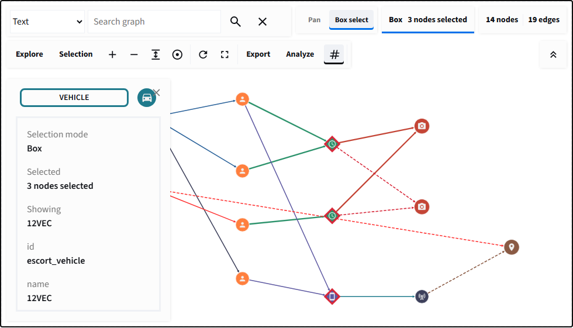

# Selection and search

## On this page

- [Selection modes](#selection-modes)
- [Pan and box-select](#pan-and-box-select)
- [Clearing selection](#clearing-selection)
- [Optional selection details](#optional-selection-details)
- [Move connected nodes](#move-connected-nodes)
- [Search modes](#search-modes)
- [Selection payload](#selection-payload)
- [Use selected records](#use-selected-records)

## Selection modes

- `single` keeps at most one selected element.
- `multiple` lets users toggle several nodes and edges.
- `box` enables multiple selection and displays a Pan/Box select mode control.

Set `return_selection=True` to receive selection changes without defining a
custom `Event`.

## Pan and box-select

Box mode separates two blank-canvas gestures that would otherwise compete.
Choose **Pan** to move around the graph. Choose **Box select** to drag a visible
rectangle over nodes. Node dragging remains available where the graph and node
state permit it.

{ .screenshot }

<p class="screenshot-caption">The explicit canvas mode prevents every blank-canvas drag from becoming a selection.</p>

## Clearing selection

Users can click a selected node again in multiple/box mode, click blank canvas,
or use **Selection > Clear Selection**. The details panel's **X** also clears
selection; it does not change the **Show selection details** preference.
The explicit Clear Selection and X actions also remove analysis-result
highlights from nodes and edges. Ordinary deselection leaves those highlights
intact. Search matches use their own Clear Search action; saved Python analysis
results are unaffected.

## Optional selection details

The **Selection > Show selection details** checkbox controls the on-canvas
inspector independently of selection. It is available even without a selected
record. Unchecking it hides the entire panel without deselecting records;
later selections do not reopen it until the checkbox is enabled again.
Rechecking it immediately shows the current selection, if one exists.

The panel's **X** clears the selected records and returned selection, leaving
the checkbox unchanged. Select another node or edge to show its details again
when the checkbox is enabled. Use the checkbox, not **X**, to hide details while
keeping your selection.

Pass `show_selection_details=False` to start with details hidden. The default is
`True`, preserving automatic details for existing applications. This is a
preference, not a restriction: users can enable details in the Selection menu.

With a stable component key, ordinary reruns preserve the browser choice.
Changing the Python argument overrides it without remounting. A new key or a
browser reload starts with the supplied value; separate graph instances have
independent preferences. The checkbox does not emit a selection event or alter
selected records, graph positions, zoom, or pan.

Selection payloads, analysis, node actions, and CRUD remain available with the
panel hidden. Use returned records to build your own detail table outside the
canvas, as in the example below. Hiding the inspector is **not access control**.

## Move connected nodes

Pass `connected_drag` to add **Move connected nodes** and a hop-depth selector
to the Selection menu:

```python
event = graph_workbench(
    elements,
    selection_mode="multiple",
    return_positions=True,
    connected_drag={
        "enabled": False,
        "depth": 1,
        "max_depth": 3,
        "max_nodes": 100,
    },
    key="connected-records",
)
```

The option is absent when `connected_drag=None`, preserving normal Cytoscape
dragging. When enabled, grabbing a node freezes an undirected scope through
currently visible nodes and edges. One hop moves immediate neighbors; two or
three hops extend that scope. Hidden, collapsed, locked, and ungrabbable nodes
do not follow. Records introduced while dragging become eligible on the next
gesture.

These movement modes remain distinct:

- Dragging an ordinary node moves that node.
- Dragging a selected node moves Cytoscape's selected group.
- Dragging a compound parent keeps Cytoscape's native descendant movement.
- Connected dragging adds eligible unselected followers without selecting them.

Followers receive exactly the anchor's position delta, so relative spacing is
preserved and edges redraw naturally. This is rigid synchronization, not a
continuous physics simulation or a new layout. It changes coordinates only;
node and edge data properties remain unchanged.

If the candidate scope exceeds `max_nodes`, no connected follower moves. Native
anchor/selected-group dragging still works, and the toolbar reports the candidate
count, configured limit, and advice to reduce depth. Connected following is also
suspended while a layout is running.

With a stable key, ordinary reruns preserve toolbar choices. An explicitly
changed Python default overrides them. Separate instances are independent, and
a reload or new key starts from the supplied defaults.

## Search modes

Enable the panel with `search=True`. Search highlights matches without selecting them,
fits the viewport around those matches, and preserves the rest of the graph as
context.

Search inputs and dropdowns use 16px text, with 14px status feedback and controls
at least 40px high. Narrow containers wrap controls onto additional rows instead
of shrinking text. Graph labels keep their independent style and zoom behavior.

| Mode | Example | Matches |
| --- | --- | --- |
| Text | `08:14` | Captions, labels, and property values |
| Node label | `VEHICLE` | Node `data.label` |
| Edge label | `SEEN_AT` | Edge `data.label` |
| Property | `risk:10` | A named data field and value |
| Selector | `node[risk >= 8]` | A Cytoscape selector |

Invalid selectors should be shown to the user as search feedback rather than
used to change Python state.

## Selection payload

The returned selection `data` dictionary contains selected node/edge IDs, connected
node/edge IDs, the last selected record, complete selected records, and complete
connected records. IDs are ideal for database queries; records are ideal for
immediate display and export.

## Use selected records

```python
--8<-- "docs/snippets/selected_records.py"
```

The dataframe can be joined to source records, filtered by confidence, grouped
by location, or passed into a case report without scraping the graph canvas.

## Conclusion

Selection is both a visual state and an application input. Keep deselection
obvious, preserve graph context during search, and explain what Python does with
the returned records.

Try `/learn_selection`, `/learn_search`, or `/investigation_tools` in the local
examples app.
