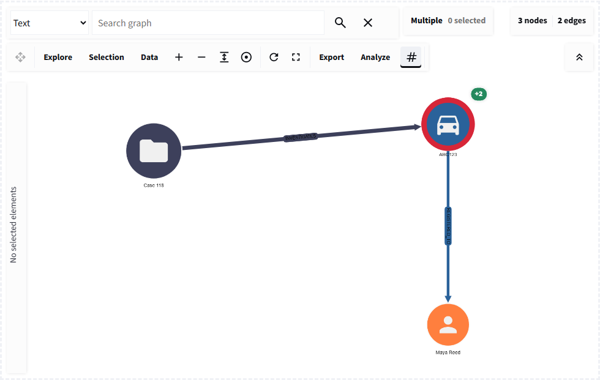

# Intelligence workflow

## On this page

- [Question and source records](#question-and-source-records)
- [Build stable entities](#build-stable-entities)
- [Build relationships](#build-relationships)
- [Render for investigation](#render-for-investigation)
- [Use the returned evidence](#use-the-returned-evidence)

## Question and source records

Assume an analyst wants to compare two vehicles observed near the same location
within an hour. Start with source records, not a pre-shaped graph:

| vehicle | location | observed at | source | confidence |
| --- | --- | --- | --- | --- |
| `ABC123` | Harbour camera 7 | 2024-09-02 08:14 | ANPR | 0.96 |
| `12VEC` | Harbour camera 7 | 2024-09-02 09:10 | CCTV | 0.88 |

## Build stable entities

Create one node for each durable entity: vehicle, location, observation time,
camera, person, or device. Prefix IDs where source namespaces can overlap, for
example `vehicle:ABC123` and `location:harbour-camera-7`. Preserve source keys
and confidence inside `data` for selectors and later joins.

## Build relationships

Create explicit edge records for `OBSERVED_AT`, `RECORDED_BY`, and
`OBSERVED_DURING`. Edge IDs should be deterministic when the source record is
durable, such as `sighting:anpr:8941`. Validate all endpoint references after
constructing the graph.

## Render for investigation

Enable only the tools required by the workflow:

```python
event = graph_workbench(
    elements,
    layout="fcose",
    node_styles=node_styles,
    edge_styles=edge_styles,
    selection_mode="box",
    return_selection=True,
    search=True,
    node_actions=["show_neighbors", "hide_unselected", "restore_hidden"],
    analysis_actions=["shortest_path", "connected_components", "degree"],
    return_positions=True,
    key="vehicle-location-investigation",
)
```

{ .screenshot }

<p class="screenshot-caption">Vehicles, locations, times, people, and devices remain distinguishable while sharing one analytical workspace.</p>

## Use the returned evidence

Turn `selected_elements` or `matched_elements` into a dataframe. Join it to the
source table, preserve provenance, and show the records beside any analytical
result. A shortest path is easier to review when each node and edge ID resolves
to its authoritative record.

For persistent changes, route CRUD or expansion events through application
services and issue validated graph commands only after the data operation
succeeds.

## Conclusion

The graph should expose relationships without replacing the records that justify
them. Stable IDs, source fields, and returned element dictionaries keep visual
analysis connected to auditable data.
